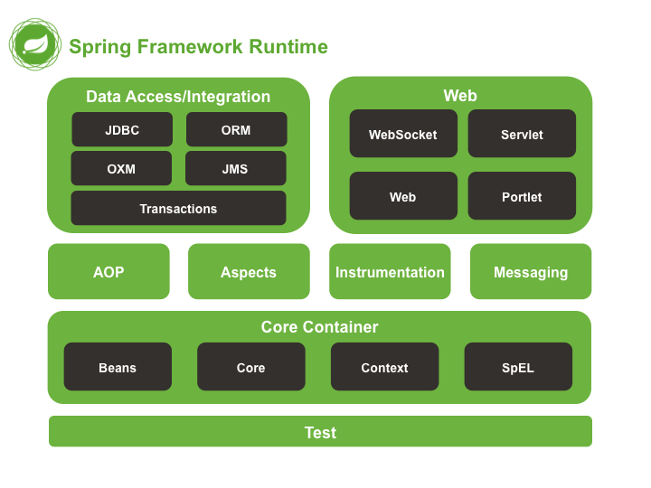

# Java Spring Framework

Debo aclarar que esto son solo apuntes de mi aprendizaje, no es ningún tipo de tutorial ni de curso, pero siempre son bienvenidos a leer mis notas.
## 📔 Spring 1
##  ¿Qué es Spring Framework?
Primero que todo, ¿Qué es un framework? Pues un framework es una "Estructura predefinida" para construir algo completamente, desde el inicio hasta el final, y no tan solo la estructura si no tambien el conjunto de funcionalidades que tu vas a necesitar.😮

Y ahora si, Spring es un framework de código abierto para la creación de apliaciones empresariales, tiene una estructura modular y una gran flexibilidad para implementar diferentes tipos de arquitecturas según las necesidades de la aplicación.

##  Core Spring

##  Spring Container y Beans
Un contenedor crea objetos, los une, los configura y administra su ciclo de vida completamente. Los Beans son objetos que maneja el contendor de spring (Spring Container).
